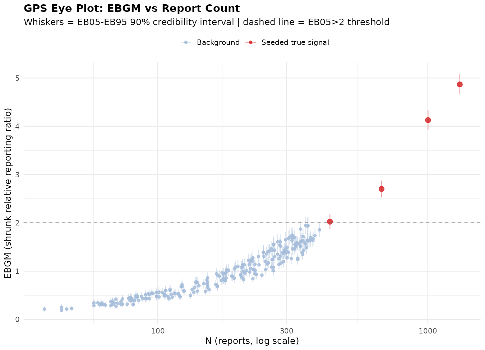
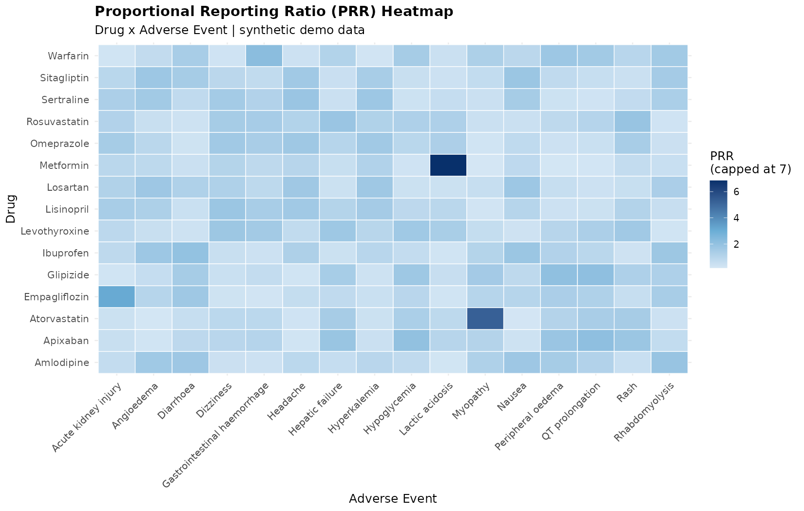
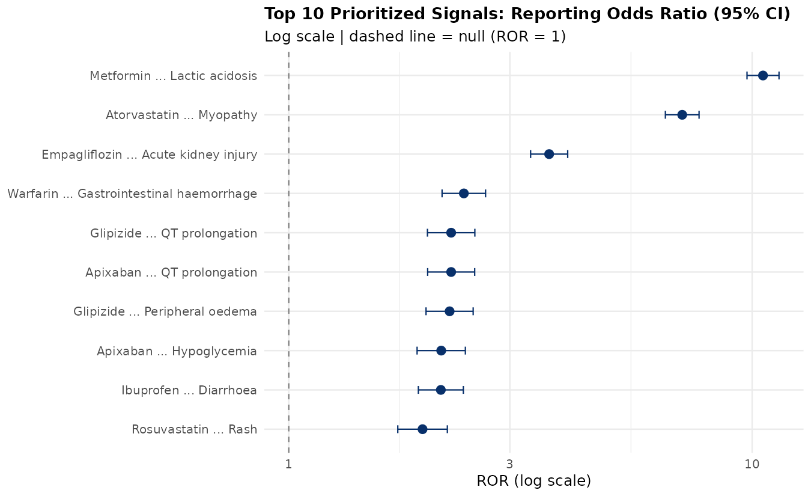

# 💊 Pharmacovigilance & Drug Safety Signal Detection

[](https://www.r-project.org/)
[](LICENSE)
[](#-project-status)
[](run_pipeline.R)
[](data/README.md)

A statistical pipeline for detecting, validating, and prioritizing drug
safety signals from post-marketing surveillance data — implementing a
**discovery → verification** workflow used in real pharmacovigilance
practice (disproportionality analysis, empirical Bayes shrinkage, and
time-to-onset clustering, combined via ensemble ranking).

> **📌 Project status:** this is an actively-developed portfolio project. The
> full statistical pipeline is implemented and runs end-to-end against a
> **synthetic, FAERS-structured dataset** (see [why, below](#-honest-status--why-synthetic-data)).
> Real-FAERS integration and the RWD verification study are the next
> milestones — see [Roadmap](#-roadmap).

---

## 📖 Table of Contents
- [Why this project](#-why-this-project)
- [Honest status / why synthetic data](#-honest-status--why-synthetic-data)
- [Architecture](#-architecture)
- [Results](#-results)
- [Quick start](#-quick-start)
- [Repository structure](#-repository-structure)
- [Methodology](#-methodology)
- [Roadmap](#-roadmap)

---

## 🎯 Why this project

Traditional drug safety signal detection relies on manual review of
spontaneous adverse-event reports — reactive, slow, and prone to missing
weak-but-real signals in noisy data. This project implements a more
proactive, statistically rigorous approach:

1. **Discovery** — mine large-scale spontaneous report data (FAERS,
   EudraVigilance, VigiBase-style) for candidate drug-event associations
   using disproportionality analysis and empirical Bayes shrinkage
2. **Verification** — cross-check candidates against a second,
   independent signal (time-to-onset clustering), then combine multiple
   methods via ensemble consensus ranking before flagging anything as a
   priority for human/epidemiological review

## 🔍 Honest status / why synthetic data

The full R pipeline below is **real, working code** — not a mockup. What's
currently synthetic is the **input data**: this environment doesn't have
network access to FAERS/openFDA, so `R/00_generate_synthetic_data.R`
generates a 50,000-row dataset structured exactly like a real FAERS extract,
with a handful of drug-event pairs deliberately seeded at an elevated
reporting rate as **ground truth**.

This is actually useful, not just a workaround: it lets the pipeline be
validated end-to-end — **the pipeline correctly recovers all 4 seeded
signals as its top 4 ranked results**, with no false positives ranked
above them (see [Results](#-results)). Swapping in a real FAERS/openFDA
extract requires no changes beyond pointing `01_data_preprocessing.R` at
the new file — see [`data/README.md`](data/README.md).

Two methods described in the original project scope (`pvEBayes`,
`WSPsignal`) were reimplemented directly in base R rather than installed
from CRAN, since this environment has no outbound CRAN access. The
statistical logic (Gamma-Poisson Shrinker EB estimation; Weibull
shape-parameter time-to-onset test) is the same — see
[`docs/methodology.md`](docs/methodology.md) for details and the exact
swap-in path once package access is available.

## 🏗 Architecture

```
Synthetic / FAERS case reports
            │
            ▼
┌───────────────────────────┐
│ 01 Data Preprocessing      │  clean, dedupe, build N_ij matrix
└──────────────┬─────────────┘
                │
   ┌────────────┼─────────────────┐
   ▼            ▼                 ▼
┌────────┐ ┌───────────┐   ┌──────────────┐
│02 PRR/  │ │03 Empirical│  │04 Time-to-    │
│ ROR/χ²  │ │ Bayes GPS  │  │  Onset Weibull│
└────┬────┘ └─────┬──────┘  └──────┬────────┘
     └─────────────┼────────────────┘
                    ▼
        ┌────────────────────────┐
        │ 05 Ensemble ranking     │  Borda consensus
        │   (Borda count)         │
        └───────────┬─────────────┘
                     ▼
        ┌────────────────────────┐
        │ 06 Visualizations +     │
        │   prioritized report    │
        └────────────────────────┘
```

## 📊 Results

Ran against the synthetic dataset (240 drug-event pairs, 50,000 case reports):

| Metric | Value |
|---|---|
| Pairs evaluated | 240 |
| Flagged by classical disproportionality (PRR≥2, χ²≥4, N≥3) | 8 |
| Flagged by empirical Bayes consensus (EB05 > 2) | 3 |
| **Seeded ground-truth signals recovered in Top 4** | **4 / 4** |

**GPS Eye Plot** — EBGM (shrunk relative reporting ratio) vs. report count.
Seeded true signals (red) separate cleanly from background noise (blue)
even after Bayesian shrinkage:



**PRR Heatmap** across all drug-event pairs:



**Forest plot** — Reporting Odds Ratio (95% CI) for the top 10 prioritized signals:



Full write-up: [`reports/signal_detection_report.md`](reports/signal_detection_report.md)

## 🚀 Quick start

```bash
# clone the repo
git clone https://github.com/<your-username>/pv-signal-detection.git
cd pv-signal-detection

# install R deps used beyond base R (survival, MASS ship with base R;
# ggplot2 is the only extra)
Rscript -e 'install.packages("ggplot2")'

# run the full pipeline: generates data, runs all analyses, produces figures
Rscript run_pipeline.R
```

Outputs land in `reports/` (CSV + figures) and `data/processed/` (intermediate tables).

## 📂 Repository structure

```
pv-signal-detection/
├── R/
│   ├── 00_generate_synthetic_data.R      # synthetic FAERS-structured data + seeded ground truth
│   ├── 01_data_preprocessing.R           # cleaning + N_ij contingency table
│   ├── 02_disproportionality_analysis.R  # PRR, ROR, chi-square
│   ├── 03_empirical_bayes_gps.R          # GPS/EBGM shrinkage (base-R implementation)
│   ├── 04_time_to_onset_weibull.R        # Weibull shape-parameter test
│   ├── 05_ensemble_ranking.R             # Borda-count consensus ranking
│   └── 06_generate_visualizations.R      # heatmap, eye plot, forest plot
├── data/
│   ├── raw/                              # synthetic input + seeded ground truth
│   ├── processed/                        # pipeline intermediates (gitignored, regenerate locally)
│   └── README.md                         # data dictionary + real-FAERS integration notes
├── reports/
│   ├── figures/                          # generated PNGs
│   ├── prioritized_signal_report.csv     # final ranked output
│   └── signal_detection_report.md        # write-up deliverable
├── docs/
│   ├── methodology.md                    # full statistical methodology
│   └── verification_study_protocol.md    # draft RWD follow-up study design
├── run_pipeline.R                        # master script — runs everything
└── LICENSE
```

## 🧪 Methodology

Full details in [`docs/methodology.md`](docs/methodology.md). Summary:

| Phase | Method | Package/approach |
|---|---|---|
| Discovery | Disproportionality (PRR, ROR, χ²) | base R |
| Discovery | Empirical Bayes GPS shrinkage (EBGM, EB05/EB95) | base R implementation of DuMouchel (1999); `pvEBayes`-compatible interface |
| Discovery | Time-to-onset clustering | `MASS::fitdistr` Weibull MLE; `WSPsignal`-equivalent shape test |
| Verification | Ensemble consensus ranking | Borda count across all three methods |
| Verification (planned) | Active comparator / stratified regression | see [roadmap](#-roadmap) |

## 🗺 Roadmap

- [x] Synthetic data generator with seeded ground-truth signals
- [x] Disproportionality analysis (PRR/ROR/χ²)
- [x] Empirical Bayes GPS shrinkage
- [x] Weibull time-to-onset test
- [x] Ensemble consensus ranking + visualizations
- [ ] Swap synthetic input for a real FAERS/openFDA quarterly extract
- [ ] Install `pvEBayes` / `WSPsignal` from CRAN and diff against the base-R implementations here
- [ ] Active comparator + stratified regression on flagged pairs (needs RWD/EHR access)
- [ ] Execute the nested case-control verification study ([protocol drafted](docs/verification_study_protocol.md))
- [ ] NLP extraction from unstructured clinical narratives / literature

## 📄 License

MIT — see [LICENSE](LICENSE).
