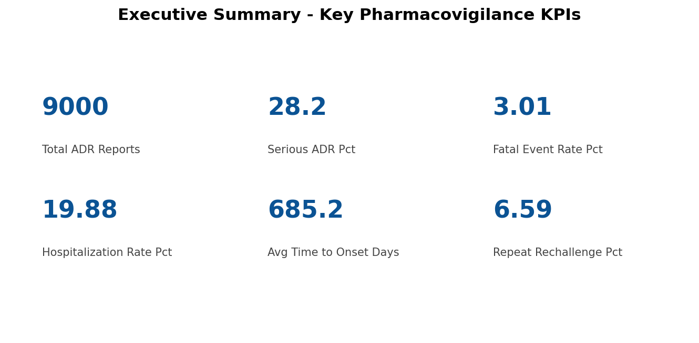
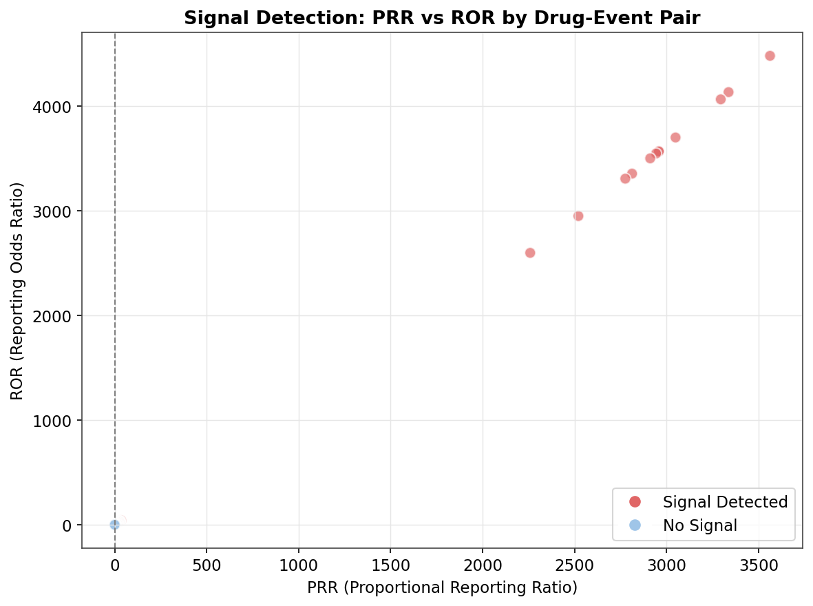
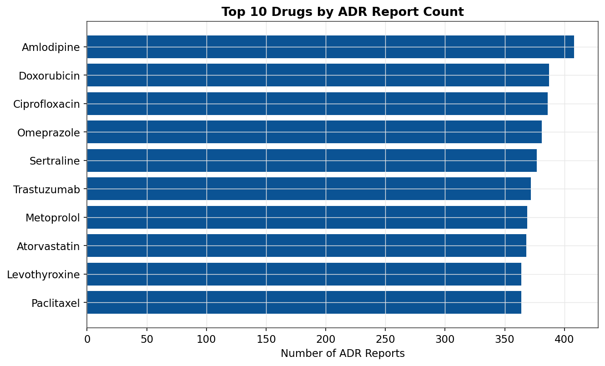
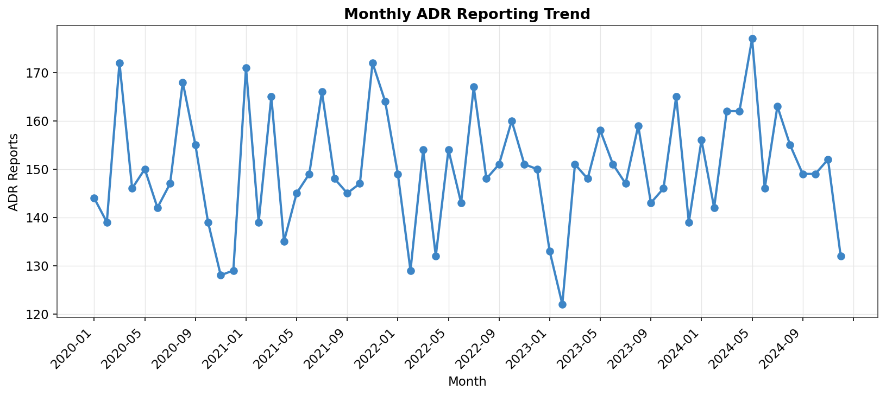
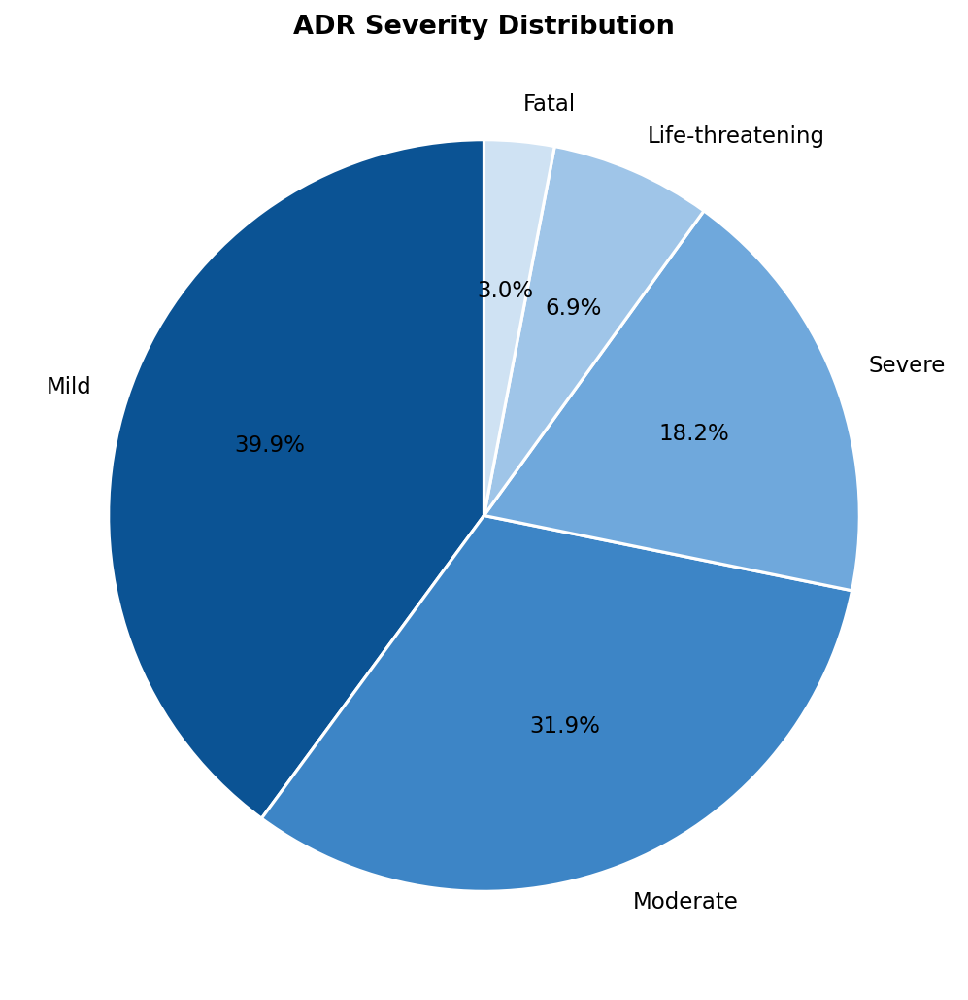
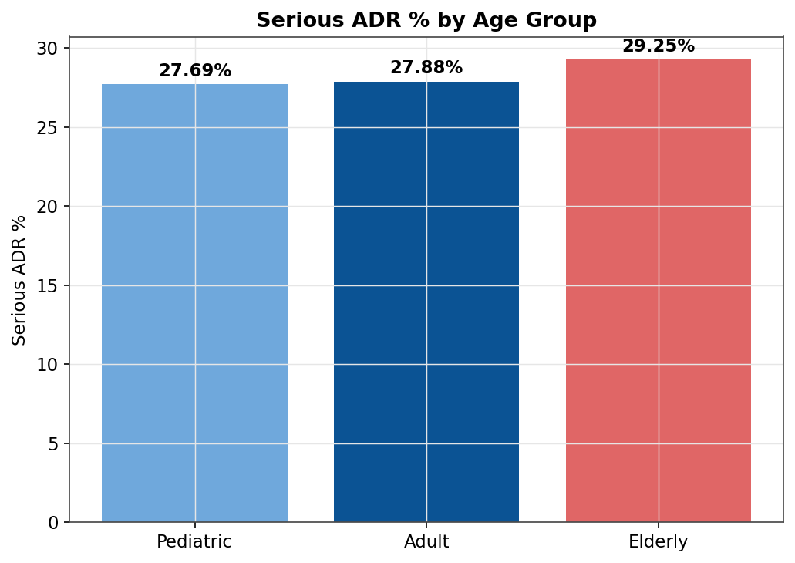
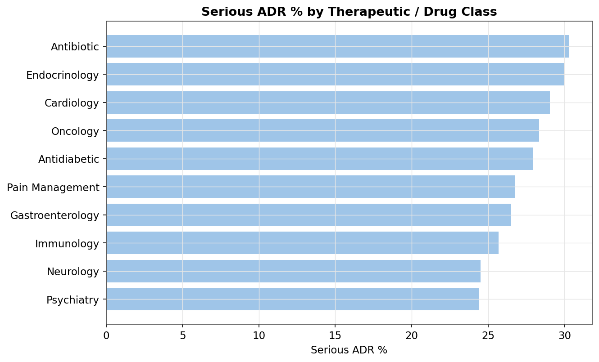
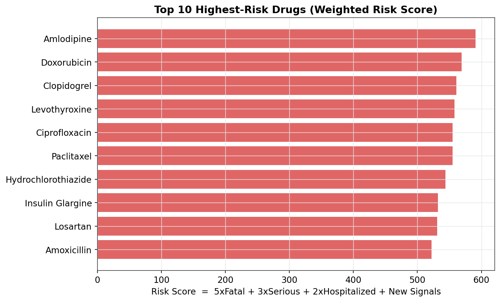

# 💊 Pharmacovigilance & Drug Safety Signal Detection Analytics Platform

An end-to-end **healthcare / pharma data analytics project** that simulates a real-world drug-safety monitoring system — the kind of work performed by pharmacovigilance (PV) analysts and drug-safety teams at organizations like Pfizer, Novartis, Roche, Sanofi, and IQVIA.

The platform ingests raw Adverse Drug Reaction (ADR) reports, cleans and models them into a relational schema, engineers analytical features, applies **industry-standard disproportionality statistics (PRR, ROR, Information Component, Chi-Square)** to detect new safety signals, and surfaces 20+ KPIs through SQL, Python, and dashboard-ready outputs.



---

## 📌 Business Problem

After a medicine is launched, millions of patients begin using it — and some side effects only become visible after thousands or millions of doses are administered in the real world. Pharmaceutical companies continuously collect ADR reports from hospitals, doctors, pharmacists, patients, clinical studies, and regulatory agencies.

**The core question:** *Which drugs are causing an unusual number of serious side effects — and how do we detect that early, before it becomes a public health issue?*

## 🎯 Business Objective

Build an analytics platform that can:
- Monitor incoming ADR reports at scale
- Identify high-risk medicines and manufacturers
- Statistically detect unusual/emerging safety signals
- Surface high-risk patient subgroups (age, comorbidities, gender)
- Track reporting trends and timeliness
- Help safety teams prioritize investigations

---

## 🏗️ Project Architecture

```
Raw ADR Data (6 relational tables, intentionally "dirty")
        │
        ▼
Data Cleaning  (Python / Pandas)
        │
        ▼
Relational SQL Database  (schema + analysis queries)
        │
        ▼
Feature Engineering  (age groups, flags, time-to-onset, etc.)
        │
        ▼
Signal Detection  (PRR, ROR, Information Component, Chi-Square)
        │
        ▼
KPI Calculation  (20+ pharmacovigilance KPIs)
        │
        ▼
Dashboard Visuals  (chart images / Power BI-ready CSVs)
        │
        ▼
Business Insights & Risk Rankings
```

---

## 🗂️ Repository Structure

```
pharmacovigilance-drug-safety-analytics/
│
├── README.md                                  <- you are here
├── requirements.txt                            <- Python dependencies
│
├── data/
│   ├── raw/                                    <- synthetic RAW data (with realistic data-quality issues)
│   │   ├── drug_table.csv
│   │   ├── patient_table.csv
│   │   ├── reporter_table.csv
│   │   ├── adverse_event_table.csv
│   │   ├── drug_exposure_table.csv
│   │   └── followup_table.csv
│   │
│   └── processed/                              <- CLEANED, analysis-ready data
│       ├── drug_table_clean.csv
│       ├── patient_table_clean.csv
│       ├── reporter_table_clean.csv
│       ├── adverse_event_table_clean.csv
│       ├── drug_exposure_table_clean.csv
│       ├── followup_table_clean.csv
│       └── master_analytics_table.csv          <- final joined + feature-engineered table (import this into BI tools)
│
├── sql/
│   ├── 01_schema.sql                           <- relational schema (6 tables, PK/FK, indexes)
│   └── 02_analysis_queries.sql                 <- 18 production-style analysis queries
│
├── python/
│   ├── 01_generate_synthetic_data.py           <- builds the raw dataset (with injected data-quality issues)
│   ├── 02_data_cleaning.py                     <- cleaning pipeline + data-quality report
│   ├── 03_feature_engineering.py               <- builds the master analytics table
│   ├── 04_signal_detection_prr_ror.py          <- PRR / ROR / IC / Chi-Square signal detection
│   ├── 05_kpi_dashboard_metrics.py             <- calculates all 20+ KPIs
│   └── 06_visualizations.py                    <- generates all chart images
│
├── outputs/
│   ├── images/                                 <- 11 dashboard-style PNG chart exports (see below)
│   └── kpi_reports/                            <- 15+ downloadable KPI CSVs + signal detection results
│
└── docs/
    └── data_dictionary.md                      <- full column-level data dictionary for all 7 tables
```

---

## 📊 Dataset Overview

The dataset is **synthetically generated** (fully reproducible via `python/01_generate_synthetic_data.py`) but modeled closely on real-world pharmacovigilance data structures (similar in spirit to FDA FAERS / EudraVigilance feeds), including deliberately injected data-quality issues so the project can demonstrate real cleaning work:

| Table | Rows (raw) | Rows (clean) | Key Quality Issues Simulated |
|---|---|---|---|
| Drug | 25 | 25 | — (master reference data) |
| Patient | 5,075 | 5,000 | missing age/gender, impossible ages, duplicate patient IDs, inconsistent country names |
| Reporter | 800 | 800 | mixed date formats |
| Adverse Event | 9,270 | 9,000 | duplicate ADR reports, drug-name spelling variants, mixed date formats, missing outcomes |
| Drug Exposure | 9,270 | 9,270 | invalid/impossible dosage values |
| Follow-up | 3,750 | 3,750 | — |

Full column definitions: [`docs/data_dictionary.md`](docs/data_dictionary.md)

---

## 🧹 Data Cleaning Highlights

`python/02_data_cleaning.py` performs and documents:

- Removing duplicate `Patient_ID`s and duplicate ADR reports
- Standardizing country names (`USA`, `U.S.A`, `us` → `United States`)
- Standardizing drug name spelling variants (`Amoxycillin`, `AMOXICILLIN` → `Amoxicillin`)
- Normalizing gender values (`M`, `male`, `Female` → `Male` / `Female`)
- Parsing three mixed date formats (`YYYY-MM-DD`, `DD/MM/YYYY`, `MM-DD-YYYY`) into a single standard
- Correcting impossible ages (negative / 150+) and imputing missing ages
- Correcting invalid dosage values (zero, negative, absurdly high)
- Filling missing outcomes with `"Unknown"` rather than dropping records

Full auto-generated report: [`outputs/kpi_reports/data_cleaning_report.txt`](outputs/kpi_reports/data_cleaning_report.txt)

---

## 🧠 Feature Engineering

`python/03_feature_engineering.py` builds a single **master analytics table** (9,000 rows × 41 columns) joining all six source tables, with engineered features including:

`Age_Group` · `Elderly_Flag` · `Pediatric_Flag` · `Chronic_Disease_Flag` · `Serious_Event_Flag` · `Fatal_Event_Flag` · `Hospitalized_Flag` · `Time_to_Onset_Days` · `Exposure_Duration_Days` · `Polypharmacy_Flag` · `Rechallenge_Flag` · `Reporting_Month` · `Reporting_Season`

---

## 🔬 Signal Detection — Disproportionality Analysis

`python/04_signal_detection_prr_ror.py` builds a 2×2 contingency table for every **(Drug, Side Effect)** pair and computes the same statistics used in real regulatory pharmacovigilance:

| Metric | Purpose |
|---|---|
| **PRR** (Proportional Reporting Ratio) | Compares the reporting proportion of a drug-event pair against all other drugs |
| **ROR** (Reporting Odds Ratio) | Estimates the odds of an event being reported for one drug vs. others |
| **Information Component (IC)** | Bayesian shrinkage measure used for signal detection |
| **Chi-Square** (Yates-corrected) | Tests whether the observed reporting rate differs from what's expected |

A signal is flagged using the standard **Evans criteria**: `PRR ≥ 2`, `Chi-Square ≥ 4`, and `≥ 3 cases`.

Results: [`outputs/kpi_reports/prr_ror_signal_detection.csv`](outputs/kpi_reports/prr_ror_signal_detection.csv)



---

## 📈 Key KPIs Tracked

| # | KPI | # | KPI |
|---|---|---|---|
| 1 | Total ADR Reports | 11 | Gender-wise ADR Rate |
| 2 | Serious ADR % | 12 | Age-wise ADR Distribution |
| 3 | Fatal Event Rate | 13 | Outcome Distribution |
| 4 | Hospitalization Rate | 14 | Avg. Time to Onset |
| 5 | Drug Risk Score (weighted) | 15 | Drug Class Risk Ranking |
| 6 | Top Drugs by ADR Count | 16 | Repeat / Rechallenge Reports % |
| 7 | Top Reported Side Effects | 17 | New Safety Signal Count (PRR/ROR) |
| 8 | Monthly ADR Trend | 18 | Reporting Timeliness |
| 9 | Reporting Rate by Country | 19 | High-Risk Patient Groups |
| 10 | Severity Distribution | 20 | Top Manufacturers by ADR Reports |

**Drug Risk Score formula:**
```
Risk Score = (5 × Fatal Events) + (3 × Serious Events) + (2 × Hospitalizations) + (New Signals)
```

All KPI outputs (downloadable CSVs): [`outputs/kpi_reports/`](outputs/kpi_reports/)

---

## 🖼️ Sample Dashboard Outputs

| | |
|---|---|
|  |  |
|  |  |
|  |  |

All 11 chart images are in [`outputs/images/`](outputs/images/) and are ready to drop directly into a Power BI/Tableau report, a slide deck, or your GitHub project showcase.

---

## 🛠️ Tech Stack

| Layer | Tools |
|---|---|
| Data Cleaning & Wrangling | Python (Pandas, NumPy) |
| Statistical Signal Detection | Python (SciPy — Chi-Square, disproportionality stats) |
| Database & Querying | SQL (MySQL / PostgreSQL compatible schema + 18 analysis queries) |
| Visualization | Matplotlib (chart exports) · Power BI / Tableau-ready CSVs |
| Version Control | Git & GitHub |
| Optional Extension | Machine Learning (Isolation Forest, XGBoost) for anomaly detection & risk prediction |

---

## ▶️ How to Reproduce

```bash
# 1. Clone the repo
git clone https://github.com/<your-username>/pharmacovigilance-drug-safety-analytics.git
cd pharmacovigilance-drug-safety-analytics

# 2. Install dependencies
pip install -r requirements.txt

# 3. Run the full pipeline (in order)
cd python
python 01_generate_synthetic_data.py      # generates data/raw/*.csv
python 02_data_cleaning.py                # generates data/processed/*_clean.csv
python 03_feature_engineering.py          # generates master_analytics_table.csv
python 04_signal_detection_prr_ror.py     # PRR / ROR / IC / Chi-Square signal detection
python 05_kpi_dashboard_metrics.py        # generates all KPI CSVs
python 06_visualizations.py               # generates all chart images
```

To explore in SQL, load the cleaned CSVs from `data/processed/` into MySQL/PostgreSQL using the schema in `sql/01_schema.sql`, then run the queries in `sql/02_analysis_queries.sql`.

To build a Power BI / Tableau dashboard, connect directly to `data/processed/master_analytics_table.csv` — it's a single, flat, analysis-ready table.

---

## 💼 Resume / Portfolio Impact

This project demonstrates:
- ✅ Healthcare & pharmaceutical domain expertise (pharmacovigilance workflows)
- ✅ End-to-end ETL: raw ingestion → cleaning → feature engineering → analysis
- ✅ Relational database design (SQL schema, PK/FK, indexing)
- ✅ KPI design and executive-level business reporting
- ✅ Regulatory-grade statistical signal detection (PRR, ROR, Chi-Square, IC)
- ✅ Dashboard-ready data visualization
- ✅ Clean, professional, reproducible GitHub project structure

This project closely mirrors real-world pharmacovigilance and drug-safety analytics work and is well-suited for portfolios targeting **pharma analytics, drug safety analytics, clinical data analytics, or healthcare data analytics** roles.

---

## 📄 License

This project uses fully synthetic data generated for educational/portfolio purposes. Free to use, modify, and extend — attribution appreciated.
